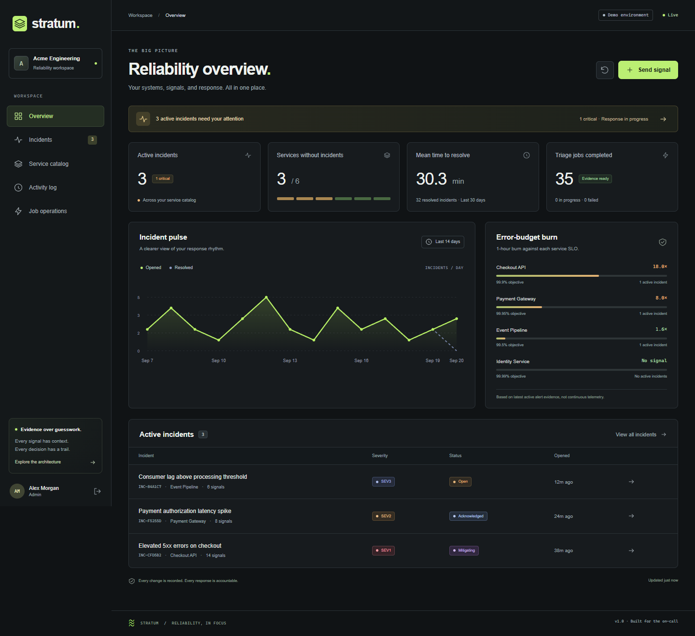
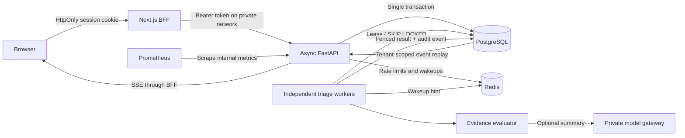

# Stratum

### Reliability, in focus. 

An evidence-driven incident command center for engineering teams. Correlate repeated alerts, understand error-budget burn, investigate with bounded recommendations, and retain a record of every response decision.

**FastAPI · Next.js 16 · React 19 · PostgreSQL 18 · Redis 8 · Python 3.13 · TypeScript**



Stratum is a working portfolio application built around real distributed-systems failure modes. It does not claim to replace a telemetry platform, automatically repair production, or establish production scale from a laptop benchmark.

## Run the complete stack

Requires Python 3.13+ for the setup script and Docker with Compose v2.

```bash
python scripts/setup.py
docker compose --profile demo up --build -d
```

Open **http://localhost:3000** once `docker compose ps` reports the API and web service healthy.

| Account | Password | Access |
| --- | --- | --- |
| `demo@stratum.local` | `stratum-demo-password` | Administrator |
| `viewer@stratum.local` | `stratum-demo-password` | Read-only |

The setup script creates unique local database and signing secrets. The demo seed is idempotent and refuses to run with `ENVIRONMENT=production`. All preloaded incidents and service metrics are explicitly sample data. Subsequent changes persist in Postgres.

```bash
docker compose logs -f api worker
docker compose --profile observability up -d prometheus
# Metrics explorer: http://localhost:9090
docker compose down
```

Only the frontend and optional metrics explorer bind to the host, both on loopback. Postgres, Redis, and the API remain on the Compose network. `docker compose down` preserves the data volumes.

## A five-minute demo

1. **Overview:** inspect active incidents, measured resolution time, incident history, and service-specific error-budget burn.
2. **Send signal:** choose Checkout API, enter a unique fingerprint, and submit the supplied example error rates. The API returns after storing a durable triage job.
3. **Investigation:** wait for the evidence panel, expand a runbook, and record an approval with a rationale. Approval does not execute infrastructure commands.
4. **Response:** acknowledge the incident, begin mitigation, then resolve it with an explanatory note. Follow the activity trail.
5. **Reliability:** resend a matching fingerprint to see correlation; use the API example below to replay an identical idempotency key. Inspect job operations and sign in as the viewer to see role restrictions.

[Detailed reviewer walkthrough](docs/DEMO.md) · [Architecture and invariants](docs/ARCHITECTURE.md) · [Verification evidence](docs/VERIFICATION.md)

## What is implemented

| Capability | Implementation |
| --- | --- |
| Multi-tenant isolation | Tenant scope comes from a verified session and current database membership, never a request body. Cross-tenant IDs return 404. |
| Role-based access | Viewer, operator, and administrator checks on the server. Existing tokens observe role changes immediately. |
| Alert correlation | A partial unique index permits only one unresolved incident per tenant/service/fingerprint. |
| Idempotent ingestion | Tenant-scoped receipt keys bind to a payload digest. Replay returns the original receipt; changed payloads receive 409. |
| Durable asynchronous triage | Incident, event, receipt, and job commit together. PostgreSQL is the durable queue. |
| Worker crash recovery | `SKIP LOCKED`, expiring leases, fencing tokens, bounded retries, and visible dead jobs. |
| Concurrent response | Versioned compare-and-swap transitions prevent silently overwriting another operator. |
| Explainable prioritization | Deterministic multi-window burn rules with explicit evidence and curated investigation actions. |
| Optional model assistance | A strict model-gateway response can add a summary only. Model failures preserve deterministic triage. |
| Live updates | Authenticated SSE, durable event cursors, Redis wakeups, bounded reconnects, and polling fallback. |
| Operator console | Responsive overview, incident search and pagination, service registration, timelines, action decisions, job retry, and sign-out. |
| API contract | Pydantic request/response models, exported OpenAPI, generated TypeScript types, and CI drift checks. |
| Observability | Structured logs, request IDs, bounded-label Prometheus metrics, readiness checks, and example alert rules. |
| Delivery | Hash-locked Python dependencies, npm lockfile, migrations, non-root multi-stage images, CI, dependency updates, and runbooks. |

## Architecture



Read the [architecture decisions](docs/ARCHITECTURE.md) for the consistency model, failure matrix, and scaling tradeoffs. This is a modular monolith plus an independently scalable worker, avoiding a distributed transaction between a database and an external queue.

## Local development without Docker

The portable development path uses SQLite and a single worker. It is useful for product development; **Postgres is required to validate concurrent processing**. Redis is optional only in development, with an in-process limiter and database polling fallback.

Install [uv](https://docs.astral.sh/uv/getting-started/installation/), Node.js 22+, and Python 3.13+.

```bash
# Terminal 1, from backend/
uv sync --python 3.13 --extra dev --frozen
uv run alembic upgrade head
uv run python -m app.seed
uv run uvicorn app.main:app --host 127.0.0.1 --port 8000

# Terminal 2, from backend/
uv run python -m app.worker

# Terminal 3, from frontend/
npm ci
# Copy .env.example to .env.local using your shell or editor.
npm run dev
```

In this Redis-free mode, `/health/live` is healthy and `/health/ready` correctly reports 503. The full Compose deployment requires Redis and fails closed when rate limiting is unavailable.

For a local production frontend build, run `npm run build` and `npm start`. `NEXT_PUBLIC_DEMO_MODE` is a build-time variable. The start script runs the standalone server with its static assets.

## Verify

```bash
# backend/
uv run ruff check .
uv run ruff format --check .
uv run pytest --cov=app --cov-branch
uv run alembic check

# frontend/
npm run typecheck
npm run format:check
npm run build
npx playwright install chromium
npm run test:e2e
```

Browser tests require the API, worker, frontend, and demo seed to be running. They modify the demo workspace. Use a disposable demo database for repeatable runs.

Set `TEST_DATABASE_URL=postgresql+asyncpg://...` to run backend tests against Postgres. Each test creates and removes a unique schema; it does not drop the database. The test user therefore needs schema creation rights. Set `TEST_REDIS_URL` to a dedicated Redis database for the real Lua rate-limit test. Without these variables, infrastructure-specific tests are explicitly skipped.

GitHub Actions runs separate backend, frontend, and Docker end-to-end jobs. The backend job uses real Postgres and Redis, checks migration drift, and audits dependencies. The browser job exercises the actual container stack and saves Playwright traces and logs. See [the recorded local results and limits](docs/VERIFICATION.md); a pipeline definition is not a claim that GitHub has already executed it.

### Update the API contract

```bash
# backend/
uv run python -m app.export_schema
# frontend/
npm run generate:api
npm run format
```

Commit the schema and generated types together. CI compares semantic OpenAPI JSON and regenerates TypeScript to detect drift.

### Update Python dependencies

```bash
# backend/
uv lock --upgrade
uv export --frozen --no-dev --no-emit-project -o requirements.lock
uv export --frozen --extra dev --no-emit-project -o requirements-dev.lock
```

The container consumes the runtime export; CI consumes the development export. Commit all three lockfiles together. Dependabot PRs touching `uv.lock` require refreshed exports.

## API example

Direct API examples use a locally running backend on port 8000. The Docker API has no host port; use an internal client or a temporary local-only port mapping when needed.

```bash
curl -s http://localhost:8000/v1/auth/login \
  -H 'Content-Type: application/json' \
  -d '{"email":"demo@stratum.local","password":"stratum-demo-password"}'

# Set TOKEN to the returned access_token. GET /v1/services provides SERVICE_ID.
curl http://localhost:8000/v1/signals \
  -H "Authorization: Bearer $TOKEN" \
  -H 'Content-Type: application/json' \
  -H 'Idempotency-Key: demo-checkout-0001' \
  -d '{"service_id":"SERVICE_ID","title":"Checkout error rate increased","fingerprint":"checkout.http.5xx","evidence":{"error_rate_5m":2.4,"error_rate_1h":1.8,"error_rate_6h":0.7,"latency_p95_ms":840,"requests_per_minute":12500,"deployment":"checkout-v2.8.1"}}'
```

Repeat the exact body and key to receive the same receipt with `replayed: true`. Change the body without changing the key to receive 409. All error-rate inputs are percentages, not fractions.

Interactive API documentation: `http://localhost:8000/docs` during local backend development.

## Deployment and boundaries

Use [DEPLOYMENT.md](docs/DEPLOYMENT.md) and [SECURITY.md](SECURITY.md) before exposing a deployment. Production mode requires Postgres, Redis, a unique signing secret, HTTPS, secure cookies, and an explicitly bootstrapped administrator. The shipped Compose stack is a local demonstration topology, not a managed high-availability platform.

The current product does not include OIDC/SSO, password reset, per-device token revocation, continuous telemetry collection, alert-provider-specific adapters, automated infrastructure execution, database row-level security, multi-region failover, or immutable external audit storage. Overview aggregation currently reads a tenant's incident history and should move to SQL rollups at substantial scale. These are documented boundaries, not hidden placeholders.

For a portfolio, the strongest story is a demonstrated invariant under failure. Walk a reviewer through a duplicate signal race, a worker lease expiry, a stale incident update, and a cross-tenant request. The tests and implementation are the evidence.

MIT licensed. See [CONTRIBUTING.md](CONTRIBUTING.md).
# stratum

# stratum


